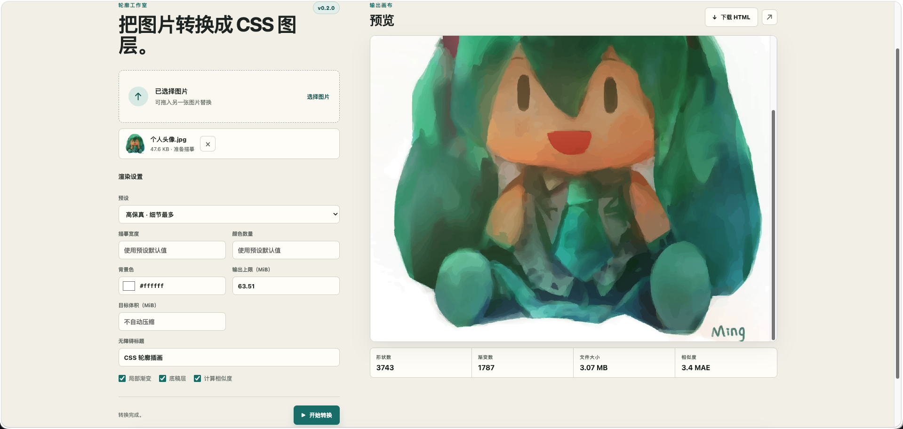
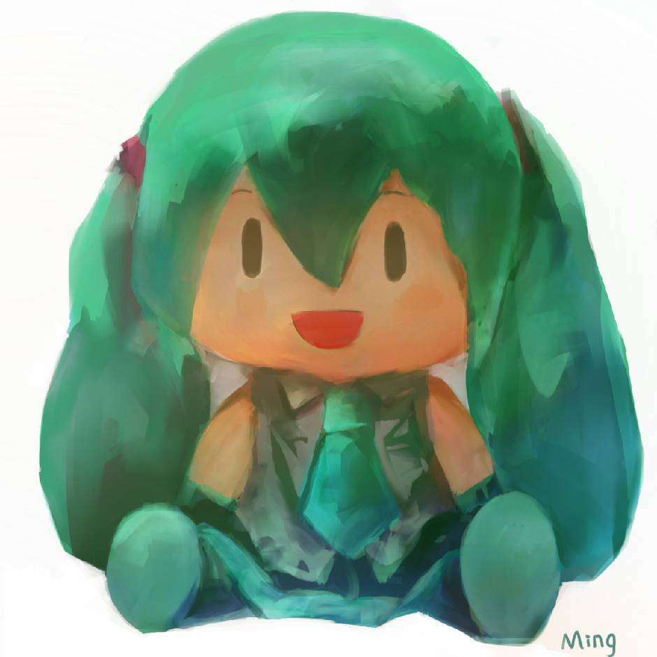

# CSS Art 项目实现说明

## 1. 项目定位

CSS Art 是一个离线的位图转 HTML/CSS 工具。它读取一张本地图片，分析图片中的颜色区域和轮廓，再生成一个可以直接在浏览器中打开的单文件 HTML。

生成结果不依赖原始图片文件，也不使用 SVG、Canvas、JavaScript、Base64 或外部资源。最终画面由多个 HTML `div` 和 CSS `clip-path` 多边形组成。

该项目做的是基于颜色和几何轮廓的有损描摹，而不是语义识别。因此它不会把人物自动拆分成头发、眼睛、衣服等具有语义的组件。它更适合插画、色块图和轮廓清晰的静态图形。

## 2. 目录结构

```text
skills/css-art/
├── scripts/image_to_css.py       # 命令行入口
└── scripts/css_art/
    ├── cli.py                    # 参数解析和转换流程编排
    ├── regions.py                # 图片预处理、颜色量化、区域合并
    ├── geometry.py               # 轮廓提取和 CSS 多边形生成
    ├── render.py                 # HTML/CSS 文档生成
    ├── quality.py                # 离线栅格化和误差评分
    └── audit.py                  # 输出 HTML/CSS 结构审计

scripts/web_app.py                # 本地 Web 服务
web/                              # Web 界面
tests/                            # 回归测试
scripts/check.py                  # 项目检查入口
```

## 3. 总体处理流程

一次转换由 `css_art.cli.convert()` 统一编排，主流程如下：

```text
读取图片
  ↓
处理 EXIF、透明度、尺寸和噪声
  ↓
在 Oklab 空间进行颜色量化
  ↓
标记颜色连通区域
  ↓
合并过小且颜色接近的区域
  ↓
提取外轮廓和内部孔洞
  ↓
拟合纯色或局部线性渐变
  ↓
生成多个绝对定位的 HTML div
  ↓
审计输出结构并写入 HTML
```

主要入口：

```text
skills/css-art/scripts/image_to_css.py
    -> css_art.cli.main()
    -> css_art.cli.convert()
```

## 4. 图片预处理

实现位置：

```text
skills/css-art/scripts/css_art/regions.py
```

核心函数是 `load_reference()`。

它完成以下工作：

1. 使用 Pillow 读取图片。
2. 拒绝动画或多帧输入。
3. 根据 EXIF 信息校正图片方向。
4. 将图片转换为 RGBA。
5. 将透明区域合成到指定背景色上。
6. 按 `max_width` 缩放，避免超大图片生成过多轮廓。
7. 使用 OpenCV 双边滤波降低噪声，同时尽量保留边缘。

转换后的图片会成为 NumPy 数组，后续算法都在这个数组上运行。原始宽高会单独保存，用于生成最终 HTML 的 `aspect-ratio`。

## 5. 颜色量化

实现位置：

```text
skills/css-art/scripts/css_art/regions.py
```

核心函数是 `quantize()`。

### 5.1 Oklab 颜色空间

项目没有直接在 RGB 数值上切分颜色，而是执行以下转换：

```text
sRGB
  -> 线性 RGB
  -> LMS
  -> Oklab
```

Oklab 更接近人眼对颜色差异的感知，因此颜色桶的边界通常比直接 RGB 切分更自然。

### 5.2 Median-cut 分桶

`quantize()` 会维护一组颜色桶：

1. 找出当前颜色范围最大的桶。
2. 找出该桶在 Oklab 中跨度最大的轴。
3. 按中点把桶拆成两个桶。
4. 直到达到目标颜色数量，或没有可继续切分的范围。
5. 计算每个桶的 RGB 平均值作为调色板颜色。

函数返回两个结果：

```text
labels[y, x]  # 每个像素对应的调色板索引
palette[i]    # 第 i 个调色板颜色
```

项目不使用抖动处理，因此结果稳定且可重复。

## 6. 连通区域和小区域合并

实现位置仍然是：

```text
skills/css-art/scripts/css_art/regions.py
```

### 6.1 连通区域标记

`label_components()` 对同一颜色的像素进行 8 邻域连通分析，并记录每个组件的：

- 颜色索引
- 像素面积
- 包围盒 `(x, y, width, height)`
- 几何中心

它使用“按颜色裁剪局部区域”的方式处理组件，避免为每个颜色都建立一张完整尺寸的掩码。

### 6.2 合并规则

`merge_regions()` 会多次扫描相邻组件，将面积小于 16 像素的组件合并到更大的邻接组件，但必须同时满足：

- 目标组件面积更大；
- 两个组件颜色的最大通道差不超过 18；
- 相对于原始颜色的累计漂移不超过 23。

这个限制可以减少碎片数量，同时避免把相距较远或颜色差异明显的细节错误合并。

## 7. 轮廓提取和孔洞处理

实现位置：

```text
skills/css-art/scripts/css_art/geometry.py
```

核心函数包括：

- `component_rings()`：从单个区域掩码中提取外轮廓和孔洞。
- `smooth_ring()`：进行轮廓平滑和顶点简化。
- `bridge_rings()`：将多个轮廓连接成一条 CSS 路径。
- `polygon_css()`：将像素坐标转换成百分比坐标。

### 7.1 轮廓提取过程

对于每个连通区域，算法会：

1. 给掩码增加边界。
2. 放大 4 倍进行子像素级轮廓采样。
3. 对区域做轻微膨胀，减少断裂和接缝。
4. 使用 OpenCV `findContours()` 提取轮廓。
5. 对轮廓进行平滑。
6. 使用 `approxPolyDP()` 按精度参数简化顶点。

最终每个轮廓会被表示为一组二维点。

### 7.2 孔洞和独立岛屿

区域可能同时包含外轮廓、内部孔洞和多个独立小岛。项目使用：

```css
clip-path: polygon(evenodd, ...)
```

并通过 `bridge_rings()` 添加零面积桥接路径，使多个轮廓可以放进一个 CSS polygon 中，同时保留偶奇填充规则。

因此环形结构和镂空区域不会被错误填满。

## 8. 颜色填充和局部渐变

实现位置：

```text
skills/css-art/scripts/css_art/render.py
```

### 8.1 纯色填充

`hex_color()` 将区域的平均 RGB 颜色转换成十六进制颜色。相同纯色会被复用为 CSS 类，例如：

```css
.p12 { background: #5fc8bd; }
```

这样可以减少重复 CSS 文本。

### 8.2 局部线性渐变

`paint_for_region()` 只对较大的区域拟合渐变：

1. 取出区域内的像素样本。
2. 使用最小二乘法拟合颜色随二维位置变化的平面。
3. 使用 SVD 找到主要颜色变化方向。
4. 根据方向计算渐变角度。
5. 取颜色分布的 3% 和 97% 分位点作为渐变起止颜色。
6. 如果颜色变化太小，则退化为纯色。

输出格式类似：

```css
background: linear-gradient(35deg, #e58a76, #f4b092)
```

面积很小的区域不拟合渐变，而是按调色板颜色合并输出，以控制 HTML 体积。

## 9. 底稿层和抗接缝处理

`ContourRenderer.underpainting()` 会生成一个低分辨率的底稿层，位于细节轮廓下面。

底稿层的处理方式是：

1. 根据参考图和背景色计算整体剪影。
2. 对剪影做中值滤波和腐蚀。
3. 将参考图缩小到较低分辨率。
4. 再次量化成较少的颜色。
5. 将这些颜色转换成覆盖整个画布的粗略多边形。

它主要用于减轻浏览器在小尺寸显示时产生的浅色边缘接缝，不承担精细轮廓的主要绘制工作。

## 10. HTML/CSS 输出

实现位置：

```text
skills/css-art/scripts/css_art/render.py
```

`render_document()` 会生成一个完整 HTML 文档，结构大致如下：

```html
<main class="illustration" role="img" aria-label="CSS 轮廓插画">
  <div class="underpainting">...</div>
  <div class="shape p0" style="...clip-path:polygon(...)..."></div>
  <div class="shape" style="...background:linear-gradient(...)..."></div>
</main>
```

每个细节形状都使用：

- `position: absolute`
- 百分比形式的 `left`、`top`、`width`、`height`
- `clip-path: polygon(...)`
- 纯色背景或线性渐变

画布使用原图宽高生成 `aspect-ratio`，因此浏览器缩放时能够保持原始比例。

输出文档还会包含严格的 Content Security Policy，禁止脚本、图片、网络请求、字体和对象资源。

## 11. 输出体积控制

`ContourRenderer.account()` 会在生成每个 HTML 片段时累计字节数。如果超过 `max-output-mb`，立即抛出 `BudgetExceeded`。

指定 `--fit` 时，CLI 会按照固定顺序重新生成：

1. 先逐步降低描摹宽度。
2. 宽度降到下限后再降低颜色数量。
3. 每次尝试都重新执行完整转换。
4. 将所有尝试记录到报告中。

这种方式不会截断已经生成的 HTML，输出始终是完整且结构合法的文档。

## 12. 结构审计

实现位置：

```text
skills/css-art/scripts/css_art/audit.py
```

`audit_html()` 使用 Python 标准库解析 HTML，并限制允许的标签和属性。

它重点检查：

- 是否只有一个 `main`；
- 是否存在正确的 CSP；
- 是否只有允许的 `div`、`style` 和无障碍属性；
- 每个 `shape` 是否包含 CSS polygon；
- 是否存在 `script`、`img`、`svg`、`canvas` 等元素；
- 是否存在 `url()`、`@import`、Base64 或 JavaScript URL；
- 是否存在事件属性或非法 class token。

该审计针对本项目自己的输出格式，不是通用 HTML 安全清洗器，也不负责判断视觉相似度。

## 13. 离线相似度评分

实现位置：

```text
skills/css-art/scripts/css_art/quality.py
```

启用 `--score` 后，项目会在生成过程中同步维护一个离线栅格画布：

1. 按输出顺序绘制底稿和形状。
2. 支持纯色和两端点线性渐变。
3. 将绘制结果与处理后的参考图比较。
4. 计算完整尺寸和 64 像素缩略图的平均绝对误差 MAE。

MAE 越低代表近似结果越接近参考图。该数值用于离线估计，不等同于浏览器真实抗锯齿后的像素差异。

## 14. Web 界面调用链

Web 界面不会重复实现图像算法，而是调用同一个 Python 转换核心。

调用流程如下：

```text
浏览器选择或拖入图片
  ↓
web/app.js 使用 FormData 提交文件和参数
  ↓
scripts/web_app.py 接收 multipart 请求
  ↓
保存到临时目录
  ↓
调用 css_art.cli.convert()
  ↓
返回 HTML 和转换报告
  ↓
浏览器通过 iframe 的 srcdoc 预览
```

生成 HTML 会通过 Blob URL 提供下载，也可以在新标签页中打开。

Web 服务默认只监听本机地址，上传内容和生成文件都保存在临时目录中。

## 15. 关键参数

| 参数                 | 作用                                    |
| -------------------- | --------------------------------------- |
| `--preset`           | 选择 preview、balanced 或 faithful 预设 |
| `--max-width`        | 限制描摹宽度                            |
| `--colors`           | 调色板最大颜色数量                      |
| `--background`       | 透明区域合成色和 HTML 画布背景色        |
| `--no-gradients`     | 关闭局部线性渐变                        |
| `--no-underpainting` | 关闭底稿层                              |
| `--max-output-mb`    | 设置输出体积上限                        |
| `--fit`              | 自动调整参数以适配目标体积              |
| `--score`            | 计算离线 MAE 相似度                     |
| `--report`           | 输出 JSON 格式转换报告                  |
| `--force`            | 允许覆盖已有输出文件                    |

## 16. 测试覆盖

回归测试位于 `tests/`，覆盖以下行为：

- 单像素和纯色输入；
- 透明背景合成；
- EXIF 方向修正；
- 超高图片尺寸限制；
- Oklab 量化；
- 孔洞和 even-odd polygon；
- 局部渐变生成；
- 细节区域不被错误合并；
- 相似度评分；
- 输出体积自动压缩；
- 输出文件原子写入；
- 默认不覆盖已有文件；
- 非法 HTML/CSS 资源审计；
- 多帧图片拒绝；
- 相同输入生成结果稳定。

项目检查入口是：

```bash
python3 scripts/check.py
```

## 17. `docs` 示例文件

项目中的 `docs` 目录可以用来保存实际转换时的输入图片和生成结果。当前示例文件的关系如下：

| 文件                 | 类型 | 作用                                         |
| -------------------- | ---- | -------------------------------------------- |
| `docs/参考事例.png`  | PNG  | 用于展示项目输入效果的参考图片               |
| `docs/个人头像.jpg`  | JPEG | 作为实际转换输入的头像图片，尺寸为 940 × 940 |
| `docs/个人头像.html` | HTML | 根据头像图片生成的独立 HTML/CSS 成品         |

### 参考事例



### 图片输入



它将图片转换成 HTML 内部的 CSS 图层，每个图层由 `div`、背景色或渐变，以及 `clip-path: polygon(...)` 组成。

可以使用下面的命令重新生成同类输出：

```bash
python3 skills/css-art/scripts/image_to_css.py convert \
  "docs/个人头像.jpg" \
  -o "docs/个人头像.html" \
  --preset faithful \
  --title "CSS 轮廓插画" \
  --force
```

生成后可以单独审计 HTML 文件：

```bash
python3 skills/css-art/scripts/image_to_css.py audit \
  "docs/个人头像.html"
```

当前 `docs/个人头像.html` 的结构审计结果为：

- HTML/CSS 结构合法；
- 轮廓图层数量：3743；
- 渐变填充数量：1787；
- 文件大小约为 3.07 MiB；
- 不包含图片标签、SVG、Canvas、JavaScript 或外部资源。

这些示例文件体现了项目的实际交付形式：输入是普通位图，输出是可以脱离输入图片独立打开的 HTML/CSS 文件。

## 18. 适用范围和限制

适合：

- 颜色区域清晰的插画；
- Logo、图标和色块构成的图形；
- 需要纯 HTML/CSS 交付的静态画面。

不适合：

- 高噪声照片；
- 复杂纹理和大量细碎像素；
- 需要语义化编辑的人物部件；
- 动画或多页图片；
- 要求像素级完全一致的场景。

输出质量和体积之间主要通过以下参数平衡：

```text
max_width  -> 描摹分辨率
colors     -> 颜色和区域数量
epsilon    -> 轮廓简化程度
passes     -> 小区域合并次数
```

在相同 Python、NumPy、Pillow 和 OpenCV 依赖版本下，项目会对相同输入和参数生成确定性的 HTML。不同依赖版本可能导致颜色量化、轮廓坐标或浮点拟合结果存在细微差异。
